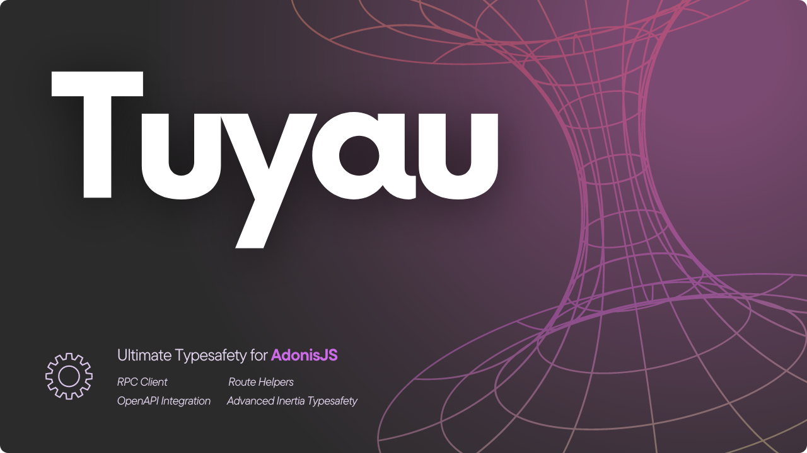

> [!WARNING]
> Tuyau is still in early development. I will **NOT follow semver until 1.0.0**. Use at your own risk.

Set of tools to create typesafe APIs using AdonisJS. The monorepo includes the following packages:

- `@tuyau/core` : Core package that you must install in your AdonisJS project.
- `@tuyau/utils` : Set of utilities and helpers for the other packages.
- `@tuyau/client` : E2E typesafe client to consume your AdonisJS APIs.
- `@tuyau/inertia` : Set of components and helpers for AdonisJS + Inertia projects.
- `@tuyau/openapi` : Experimental package to generate a "not-so-bad" OpenAPI definition from your AdonisJS project based on the Tuyau codegen.

## Goals of the project

The main goal of this project is to provide some utilities to have better typesafety when creating APIs with AdonisJS. Goals on the long term are :

- **Done (Experimental)** : Provide an RPC-like client that is fully e2e typesafe ( like tRPC, Elysia Eden, Hono etc. )
- **Done (Experimental)** : Provide a [Ziggy](https://github.com/tighten/ziggy)-like helper to generate and use routes in the frontend.
- **Done (Experimental)** : Having an automatic OpenAPI generation + Swagger/Scalar UI viewer based on Tuyau codegen.
- **In Progress** : Provide some Inertia helpers to have better typesafety when using Inertia in your AdonisJS project. Things like typesafe `<Link />` and `useForm`.
- **Not started** : Provide a specific Controller class that will allow to have better typesafety when creating your endpoints.

## Installation

First make sure to install the core package in your AdonisJS project:

```bash
node ace add @tuyau/core
```

Then, you can install the client package in your frontend project:

```bash
pnpm add @tuyau/client
```

## Usage

### Core package

The core package expose a single command called `node ace tuyau:generate`. This command will generate the typescript types needed for the client package to work.

This command will NOT run automatically for now. You will need to run it manually after some specific changes in your AdonisJS project :

- When adding a new route/controller in your project
- When adding a `request.validateUsing` call in your controller method.

Other than that, you will not need to run this command. Let's say you update the return type of a controller method, or you update the Vine schema : you DON'T need to run the command.

Later on, we will use the [`onSourceFileChanged` hook](https://docs.adonisjs.com/guides/experimental-assembler-hooks#onsourcefilechanged) to run the command automatically when needed.

To run the command manually, you must run :

```bash
node ace tuyau:generate
```

### Sharing the API definition

The command will generate a file called `.adonisjs/api.ts` in your project. This file will contain the definition of your API. You must export this file in your project to use the client package.

So, let's say your monorepo structure is like this :

```
apps
  frontend
  server
```

You must export the `.adonisjs/api.ts` file from your server workspace using [subpath exports](https://nodejs.org/api/packages.html#subpath-exports) : 

```jsonc
// package.json
{
  "name": "@acme/server",
  "type": "module",
  "version": "0.0.0",
  "private": true,
  "exports": {
    "./api": "./.adonisjs/api.ts"
  },
}
```

Once done, make sure to include `@acme/server` as a dependency in your frontend workspace :

```jsonc
// package.json
{
  "name": "@acme/frontend",
  "type": "module",
  "version": "0.0.0",
  "private": true,
  "dependencies": {
    "@acme/server": "workspace:*"
  }
}
```

> [!WARNING]
> Make sure you package manager or monorepo tool is able to resolve the `workspace:*` syntax. If not, you will need to use whatever syntax your tool is using.

Then you should be able to import the API definition in your frontend project :

```ts
import { api } from '@acme/server/api'
```


#### Initializing the client

Once installed, you must create the tuyau client in your frontend project : 

```ts
/// <reference path="../../adonisrc.ts" />

import { createTuyau } from '@tuyau/client'
import { api } from '@your-monorepo/server/.adonisjs/api'

export const tuyau = createTuyau({
  api,
  baseUrl: 'http://localhost:3333',
})
```

Multiple things to note here :

- We must reference the `adonisrc.ts` file at the top of the file. By doing that, the frontend project will be aware of some types defined in the AdonisJS project.
- We must import `api` from the `.adonisjs/api` file in your AdonisJS project. You should change the path to match your project structure.
- As you can see, the `api` is not a type, but a real object. You may ask why ? `api` is an object that contains two things :
  - The definition of you API. This is just a type. No runtime code for that.
  - The routes of your API. This is a "real" object that contains all the routes with their names and paths. Since we need to map the route names to the paths, we need to have some runtime code for that.

If you are not interested in using the route names in your frontend project, you can just import the `ApiDefinition` type from the `@tuyau/client` package and ignore the `api` object :

```ts
/// <reference path="../../adonisrc.ts" />

import { createTuyau } from '@tuyau/client'
import type { ApiDefinition } from '@your-monorepo/server/.adonisjs/api'

export const tuyau = createTuyau<{ definition: ApiDefinition }>({
  baseUrl: 'http://localhost:3333',
})
```

By doing that, you will not have additional runtime code in your frontend project but you will lose the ability to use the route names in your frontend project ( `$has`, `$current`, `$route` and other route helpers ). However, you will still benefit from the typesafety of the API definition when calling your routes by their path ( e.g. `tuyau.users.$get()` ).

##### Options

Tuyau client is built on top of [Ky](https://github.com/sindresorhus/ky). Make sure to check the documentation of Ky to see all the available options. You can pass options to the client like this :

```ts
const tuyau = createTuyau({
  api,
  baseUrl: 'http://localhost:3333',
  timeout: 10_000,
  headers: { 'X-Custom-Header': 'foobar' },
  hooks: {
    beforeRequest: [
      (request) => {
        const token = getToken()
        if (token) {
          request.headers.set('Authorization', `Bearer ${token}`)
        }
      }
    ]
  }
})
```

#### Making requests

Making requests with Tuyau is pretty straightforward. Basically, what you need to chain the different parts of the route you want to call, use `.` instead of `/` and finally call the `$method` you want to use.

```ts
import { tuyau } from './tuyau'

// GET /users
await tuyau.users.$get()

// POST /users { name: 'John Doe' }
await tuyau.users.$post({ name: 'John Doe' })

// PUT /users/1 { name: 'John Doe' }
await tuyau.users({ id: 1 }).$put({ name: 'John Doe' })

// GET /users/1/posts?limit=10&page=1
await tuyau.users.$get({ query: { page: 1, limit: 10 } })
```

#### Making Requests using the route name

If you want to use the names of the routes instead of paths, you can use the `$route` method : 

```ts
// Backend
router.get('/posts/:id/generate-invitation', '...').as('posts.generateInvitation')

// Client
await tuyau.$route('posts.generateInvitation', { id: 1 }).$get({
  query: { limit: 10, page: 1 }
})
```

#### Path parameters

If you need to call a route that has some path parameters, you can pass an object to the related function. Here is an example :

```ts
// Backend
router.get('/users/:id/posts/:postId/comments/:commentId', '...')

// Frontend
const result = await tuyau.users({ id: 1 })
  .posts({ postId: 2 })
  .comments({ commentId: 3 })
  .$get()
```

#### Request Parameters

You can pass specific `Ky` options to the request by passing a second argument to the request method : 

```ts
await tuyau.users.$post({ name: 'John Doe' }, {
  headers: {
    'X-Custom-Header': 'foobar'
  }
})
```

When using the `$get` method you can pass a `query` object to the request : 

```ts
await tuyau.users.$get({
  headers: {
    'X-Custom-Header': 'foobar'
  },
  query: {
    page: 1,
    limit: 10
  }
})
```

Note that the `query` object will be automatically serialized to a query string with the following rules :

- If the value is an array, it will be serialized using the `brackets` format. For example, `{ ids: [1, 2, 3] }` will be serialized to `ids[]=1&ids[]=2&ids[]=3`.
<!-- - If the value you pass is an object, it will be serialized as a JSON string. For example, `{ filter: { name: 'John Doe' } }` will be serialized to `filter={"name":"John Doe"}`. -->
- If the value is null or undefined, it will be ignored and not added to the query string.


#### File uploads

You can pass `File` instances to the request to upload files. Here is an example :

```html
<input type="file" id="file" />
```

```ts
const fileInput = document.getElementById('file') as HTMLInputElement
const file = fileInput.files[0]

await tuyau.users.$post({ avatar: file })
```

As soon as you pass a `File` instance in the request, Tuyau will automatically convert it to a `FormData` instance and set the correct headers for you. The payload will be serialized using the [`object-to-formdata`](https://www.npmjs.com/package/object-to-formdata) package.

Note that if you are using React Native, you should pass your file as follows :

```ts
await tuyau.users.$post({ 
  avatar: { 
    uri: 'file://path/to/file',
    type: 'image/jpeg',
    name: 'avatar.jpg'
  } 
})
```

#### Responses

For every request, Tuyau will return a promise with the following types : 

- `data` : The response data if status is 2xx
- `error` : The error data if status is 3xx
- `status` : The status code of the response
- `response` : The full response object

Once returned, you must narrow the type of the response. That means you must check if the status is 2xx or 3xx and then use the `data` or `error` property accordingly. 

Let's take a dumb example. A simple route that will return a 401 if the password is not `password`, otherwise it will return a secret token :

```ts
// Backend
class MyController {
  public async login({ request, response }) {
    const { email, password } = request.validateUsing(schema)
    if (password !== 'password') {
      return response.unauthorized({ message: 'Invalid credentials' })
    }

    return { token: 'secret-token' }
  }
}

router.post('/login', [MyController, 'login'])

// Frontend
const { data, error } = await tuyau.login.$post({ email: 'foo@ok.com', password: 'password' })

data
// ^? { token: string } | null

if (error?.status === 401) {
  console.error('Wrong password !!')
  return
}

console.log(data.token)
//          ^? { token: string }
// data.token will be available and unwrapped here
```

Without narrowing the type of the response, `data` and `error` could be `undefined`, so you must check that in your code before using them.

##### Unwrapping the response

Sometimes, you may not want to check or handle the error specifically in your code. You can use the `unwrap` method to unwrap the response and throw an error if the status is not 2xx.

```ts
const result = await tuyau.login.$post({ email: 'foo@ok.com' }).unwrap()
console.log(result.token)
```

#### Infering request and responses

The client package expose some helpers for inferring the request and response types of a route. Here is an example :

```ts
import type { InferResponseType, InferErrorType, InferRequestType } from '@tuyau/client';

// InferResponseType
type LoginRequest = InferRequestType<typeof tuyau.login.post>;

// InferResponseType
type LoginResponse = InferResponseType<typeof tuyau.login.post>;

// InferErrorType
type LoginError = InferErrorType<typeof tuyau.login.post>;
```

#### Generating URL

If you need to generate the URL of a route without making the request, you can use the `$url` method :

```ts
const url = tuyau.users.$url()
console.log(url) // http://localhost:3333/users

const url = tuyau.users({ id: 1 }).posts({ postId: 2 }).$url()
console.log(url) // http://localhost:3333/users/1/posts/2
```

##### Generating URL from route name

If you need to generate the URL of a route using the route name, you can use the `$url` method. This method is pretty similar to [Ziggy](https://github.com/tighten/ziggy) behavior :

```ts
tuyau.$url('users.posts', { id: 1, postId: 2 }) // http://localhost:3333/users/1/posts/2
tuyau.$url('venues.events.show', [1, 2]) // http://localhost:3333/venues/1/events/2
tuyau.$url('users', { query: { page: 1, limit: 10 } }) // http://localhost:3333/users?page=1&limit=10
```

If you are used to Ziggy and prefer to have a `route` method instead of `$url`, you can define a custom method in your client file pretty easily :

```ts
export const tuyau = createTuyau({
  api,
  baseUrl: 'http://localhost:3333'
})

window.route = tuyau.$url.bind(tuyau)
```

Then you can use the `route` method in your frontend code :

```tsx
export function MyComponent() {
  return (
    <div>
      <a href={route('users.posts', { id: 1, postId: 2 })}>Go to post</a>
    </div>
  )
}
```

#### Check the current route

Tuyau has some helpers to check the current route. You can use the `$current` method to get or check the current route :

```ts
// Current window location is http://localhost:3000/users/1/posts/2, route name is users.posts.show
tuyau.$current() // users.posts
tuyau.$current('users.posts.show') // true
tuyau.$current('users.*') // true
tuyau.$current('users.edit') // false
```

You can also specify route parameters or query parameters to check :

```ts
tuyau.$current('users.posts.show', { params: { id: 1, postId: 2 } }) // true
tuyau.$current('users.posts.show', { params: { id: 12 } }) // false
tuyau.$current('users.posts.show', { query: { page: 1 } }) // false
```

#### Check if a route exists

If you need to check if a route name exists, you can use the `$has` method. You can also use wildcards in the route name :

```ts
tuyau.$has('users') // true
tuyau.$has('users.posts') // true
tuyau.$has('users.*.comments') // true
tuyau.$has('users.*') // true
tuyau.$has('non-existent') // false
```

#### Filtering generated routes

If you need to filter the routes that are generated by Tuyau, you can use the `only` and `except` options in `config/tuyau.ts` :

```ts
export default defineConfig({
  codegen: {
    definitions: {
      only: [/users/],
      // OR
      except: [/users/]
    },

    routes: {
      only: [/users/],
      // OR
      except: [/users/]
    }
  }
})
```

Only one of `only` or `except` can be used at the same time. Both accept either an array of strings, an array of regular expressions or a function that will receive the route name and must return a boolean.

`definitions` will filter the generated types in the `ApiDefinition` interface. `routes` will the filter the route names that are generated in the `routes` object.

## Inertia package

Tuyau also provides a set of helpers for Inertia projects. The package is called `@tuyau/inertia`. First, make sure to have generated the API definition in your AdonisJS project using `@tuyau/core` and also have configured the client in your frontend project using `@tuyau/client`.

Then, you can install the package in your frontend project :

```bash
pnpm add @tuyau/inertia
```
### React usage

To use the Inertia helpers in your React x Inertia project, you must wrap your app with the `TuyauProvider` component :

```tsx
// inertia/app/app.tsx
import { TuyauProvider } from '@tuyau/inertia/react'
import { tuyau } from './tuyau'

createInertiaApp({
  // ...

  setup({ el, App, props }) {
    hydrateRoot(
      el,
      <>
        <TuyauProvider client={tuyau}>
          <App {...props} />
        </TuyauProvider>
      </>
    )
  },
})
```

As you can see, you must pass an instance of the Tuyau client to the `TuyauProvider` component. Also, if you are using SSR, make sure to also wrap your app with the `TuyauProvider` component in your `inertia/app/ssr.tsx` file.

#### Link

The `Link` component is a wrapper around the Inertia `Link` component with some additional typesafety. Tuyau `Link` component will accept the same props as the Inertia `Link` component except for the `href` and `method` props. They are replaced by the `route` and `params` props.

```tsx
import { Link } from '@tuyau/inertia/react'

<Link route="users.posts.show" params={{ id: 1, postId: 2 }}>Go to post</Link>
```

### Vue usage

To use the Inertia helpers in your Vue x Inertia project, you must install the Tuyau plugin :

```ts
// inertia/app/app.ts

import { TuyauPlugin } from '@tuyau/inertia/vue'
import { tuyau } from './tuyau'

createInertiaApp({
  // ...

  setup({ el, App, props, plugin }) {
    createSSRApp({ render: () => h(App, props) })
      .use(plugin)
      .use(TuyauPlugin, { client: tuyau })
      .mount(el)
  },
})
```

As you can see, you must pass an instance of the Tuyau client to the `TuyauPlugin` plugin. Also, if you are using SSR, make sure to also install the `TuyauPlugin` plugin in your `inertia/app/ssr.ts` file.

#### Link

The `Link` component is a wrapper around the Inertia `Link` component with some additional typesafety. Tuyau `Link` component will accept the same props as the Inertia `Link` component except for the `href` and `method` props. They are replaced by the `route` and `params` props.

```vue
<script setup lang="ts">
import { Link } from '@tuyau/inertia/vue'
</script>

<template>
  <Link route="users.posts.show" :params="{ id: 1, postId: 2 }">Go to post</Link>
</template>
```

## OpenAPI package

> [!WARNING]
> OpenAPI package is still experimental and may not work as expected. Please feel free to open an issue if you encounter any problem.

The `@tuyau/openapi` package allows you to generate an OpenAPI specification for your API from the Tuyau codegen. The specification is generated from the types of routes and validation schemas, using the Typescript compiler and `ts-morph`. Therefore, it has some limitations compared to manually written specifications (whether via decorators, JS doc, YAML files, or Zod schemas describing the inputs/outputs of the routes).

During development, the specification will be generated on the fly with each request, which can take a bit of time for large APIs with many routes. In production, the specification will be generated at build time into a `.yml` file and the same specification will be served for each request.

### Installation

To install the package, you will obviously need to have the `@tuyau/core` package already installed in your AdonisJS project. Then, you can install the `@tuyau/openapi` package:

```bash
node ace add @tuyau/openapi
```

### Usage

Once the package is configured, you can directly access your API's OpenAPI specification at the `/docs` address. The `/openapi` route is also available to directly access the OpenAPI specification.

### Customizing the Specification

To customize the specification, the package exposes `openapi` macros on the routes. These macros allow you to add additional information to the OpenAPI specification. For example, you can add tags, descriptions, responses, parameters, etc.

```ts
router.group(() => {
  router
    .get("/random", [MiscController, "index"])
    .openapi({ summary: "Get a random thing" });

  router
    .get("/random/:id", [MiscController, "show"])
    .openapi({ summary: "Get a random thing by id" });
})
  .prefix("/misc")
  .openapi({ tags: ["misc"] });
```

Feel free to use your editor's autocomplete to see all available options.

Also, from the `config/tuyau.ts` file, you have the ability to customize the OpenAPI specification with the `openapi.documentation` property:

```ts
const tuyauConfig = defineConfig({
  openapi: {
    documentation: {
      info: { title: 'My API!', version: '1.0.0', description: 'My super API' },
      tags: [
        { name: 'subscriptions', description: 'Operations about subscriptions' },
      ],
    },
  },
});
```

### Configuration

The package configuration is done via the `config/tuyau.ts` file, under the `openapi` key. The available options are as follows:

#### `provider`

The OpenAPI viewer to use. Two providers are available: `swagger-ui` and `scalar`. By default, the `scalar` provider is used.

#### `exclude`

Paths to exclude from the OpenAPI specification. By default, no paths are excluded. You can pass an array of strings or regex.

Example:

```ts
const tuyauConfig = defineConfig({
  openapi: {
    exclude: ['/health', /admin/]
  }
});
```

#### `endpoints`

The endpoints where the OpenAPI specification and documentation will be available. By default, the OpenAPI specification will be available at `/openapi` and the documentation at `/docs`.

Example:

```ts
const tuyauConfig = defineConfig({
  openapi: {
    endpoints: {
      spec: '/my-super-spec',
      ui: '/my-super-doc'
    }
  }
});
```

#### `scalar`

The options to pass to the `scalar` provider when used. More details [here](https://github.com/scalar/scalar?tab=readme-ov-file#configuration).

#### `swagger-ui`

The options to pass to the `swagger-ui` provider when used. More details [here](https://swagger.io/docs/open-source-tools/swagger-ui/usage/configuration/).

## Sponsors


## Credits

- Tuyau was inspired a lot by [Elysia](https://elysiajs.com/eden/treaty/overview), [tRPC](https://trpc.io/) and [Hono](https://hono.dev/) for the RPC client.
- Route helpers were inspired by [Ziggy](https://github.com/tighten/ziggy)

Thanks to the authors of these projects for the inspiration !
